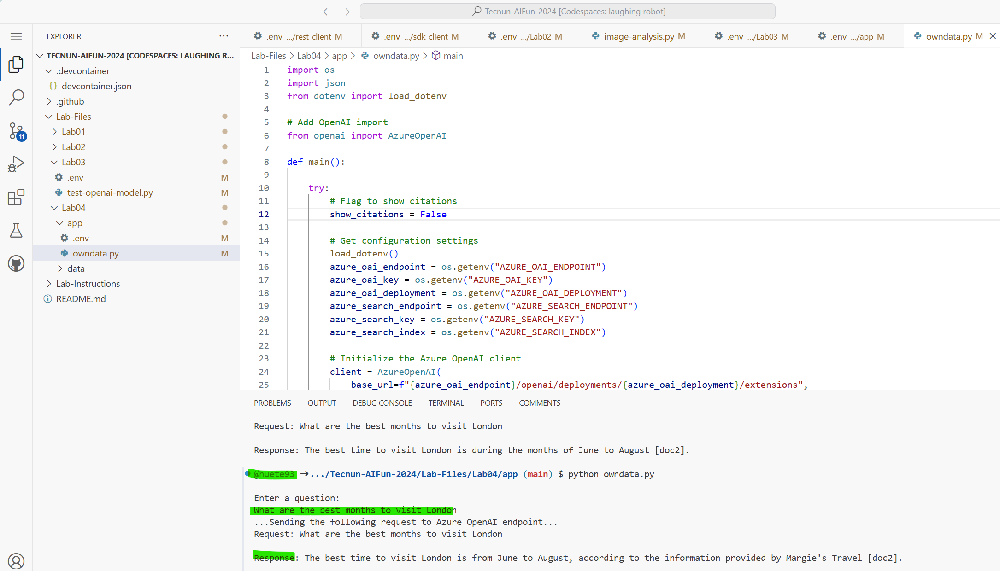

# Implement Retrieval Augmented Generation (RAG) with Azure OpenAI Service

The Azure OpenAI Service enables you to use your own data with the intelligence of the underlying LLM. You can limit the model to only use your data for pertinent topics, or blend it with results from the pre-trained model.

In the scenario for this exercise, you will perform the role of a software developer working for Margie's Travel Agency. You will explore how use Azure AI Search to index your own data and use it with Azure OpenAI to augment prompts.

This exercise will take approximately **30** minutes.

## Provision Azure resources

To complete this exercise, you'll need:

- An Azure OpenAI resource.
- An Azure AI Search resource.
- An Azure Storage Account resource.

1. Sign into the **Azure portal** at `https://portal.azure.com`.
2. You will use the **Azure OpenAI** resource from previous lab.

3. Create an **Azure AI Search** resource with the following settings:
    - **Subscription**: *The subscription in which you provisioned your Azure OpenAI resource*
    - **Resource group**: *The resource group in which you provisioned your Azure OpenAI resource*
    - **Service name**: *A unique name of your choice*
    - **Location**: *The region in which you provisioned your Azure OpenAI resource*
    - **Pricing tier**: Basic
4. While the Azure AI Search resource is being provisioned, create a **Storage account** resource with the following settings:
    - **Subscription**: *The subscription in which you provisioned your Azure OpenAI resource*
    - **Resource group**: *The resource group in which you provisioned your Azure OpenAI resource*
    - **Storage account name**: *A unique name of your choice*
    - **Region**: *The region in which you provisioned your Azure OpenAI resource*
    - **Performance**: Standard
    - **Redundancy**: Locally redundant storage (LRS)
5. After all three of the resources have been successfully deployed in your Azure subscription, review them in the Azure portal and gather the following information (which you'll need later in the exercise):
    - The  **endpoint** and a **key** from the Azure OpenAI resource you created (available on the **Keys and Endpoint** page for your Azure OpenAI resource in the Azure portal)
    - The **endpoint** for your Azure AI Search service (the **Url** value on the overview page for your Azure AI Search resource in the Azure portal).
    - A **primary admin key** for your Azure AI Search resource (available in the **Keys** page for your Azure AI Search resource in the Azure portal).

## Upload your data

You're going to ground the prompts you use with a generative AI model by using your own data. In this exercise, the data consists of a collection of travel brochures from the fictional *Margies Travel* company.

1. Gotuo your GitHub Codespace and download the pdfs in the folder **Lab-Files/Lab04/data**.
1. In the Azure portal, navigate to your **storage account** and view the **Storage browser** page.
1. Select **Blob containers** and then add a new container named `margies-travel`.
1. Select the **margies-travel** container, and then upload the .pdf brochures you donwloaded.

## AI models

You're going to use two AI models in this exercise:

- A text embedding model to *vectorize* the text in the brochures so it can be indexed efficiently for use in grounding prompts.
- A GPT model that you application can use to generate responses to prompts that are grounded in your data. **Same gpt4 model from lab03**

To deploy these models, you'll use AI Studio.

1. In the Azure portal, navigate to your Azure OpenAI resource. Then use the link to open your resource in **Azure AI Studio**..
1. In Azure AI Studio, on the **Deployments** page, view your existing model deployments. Then create a new **base model** deployment of the **text-embedding-ada-002** model with the following settings:
    - **Deployment name**: text-embedding-ada-002
    - **Model**: text-embedding-ada-002
    - **Model version**: *The default version*
    - **Deployment type**: Standard
    - **Tokens per minute rate limit**: 5K\*
    - **Content filter**: DefaultV2
    - **Enable dynamic quota**: Enabled


## Create an index

To make it easy to use your own data in a prompt, you'll index it using Azure AI Search. You'll use the text embedding model you deployed previously during the indexing process to *vectorize* the text data (which results in each text token in the index being represented by numeric vectors - making it compatible with the way a generative AI model represents text)

1. In the Azure portal, navigate to your **Azure AI Search** resource.
1. On the **Overview** page, select **Import and vectorize data**.
1. In the **Setup your data connection** page, select **Azure Blob Storage** and configure the data source with the following settings:
    - **Subscription**: The Azure subscription in which you provisioned your storage account.
    - **Blob storage account**: The storage account you created previously.
    - **Blob container**: margies-travel
    - **Blob folder**: *Leave blank*
    - **Enable deletion tracking**: Unselected
    - **Authenticate using managed identity**: Unselected
1. On the **Vectorize your text** page, select the following settings:
    - **Kind**: Azure OpenAI
    - **Subscription**: The Azure subscription in which you provisioned your Azure OpenAI service.
    - **Azure OpenAI Service**: Your Azure OpenAI Service resource
    - **Model deployment**: text-embedding-ada-002
    - **Authentication type**: API key
    - **I acknowledge that connecting to an Azure OpenAI service will incur additional costs to my account**: Selected
1. On the next page, do <u>not</u> select the option to vectorize images or extract data with AI skills.
1. On the next page,  schedule the indexer to run once.
1. On the final page, set the **Objects name prefix** to `margies-index` and then **create** the index.

## Prepare to develop an app in Github Codespace

Now let's explore the use of your own data in an app that uses the Azure OpenAI service SDK. You'll develop your app using Github Codespace. The code files for your app have been provided in a GitHub repo.


1. Start Github Codespace.


## Configure your application

1. In Github Codespace, in the **Explorer** pane, browse to the **Lab-files/Lab04/app** folder. It contains the language-specific files for an app into which you're going to integrate Azure OpenAI functionality.
2. Right-click the **app** folder containing your code files and open an integrated terminal. Then install the Azure OpenAI SDK package by running the appropriate command:

    

    **Python**:

    ```
    pip install openai==1.13.3
    ```

3. In the **Explorer** pane, in the **app** folder, open the configuration file

    - **C#**: appsettings.json
    - **Python**: .env
    
4. Update the configuration values to include:
    - The  **endpoint** and a **key** from the Azure OpenAI resource you created (available on the **Keys and Endpoint** page for your Azure OpenAI resource in the Azure portal)
    - The **deployment name** you specified for your gpt-35-turbo model deployment (available in the **Deployments** page in Azure AI Studio).
    - The endpoint for your **search** service (the **Url** value on the overview page for your search resource in the Azure portal).
    - A **key** for your **search** resource (available in the **Keys** page for your search resource in the Azure portal - you can use either of the admin keys)
    - The name of the search index (which should be `margies-index`).
5. Save the configuration file.

### Add code to use the Azure OpenAI service

Now you're ready to use the Azure OpenAI SDK to consume your deployed model.

1. In the **Explorer** pane, in the **app** folder, open the code file , and replace the comment ***Configure your data source*** with code to add the Azure OpenAI SDK library:

    

    **Python**: ownData.py

    ```python
    # Configure your data source
    extension_config = dict(dataSources = [  
            { 
                "type": "AzureCognitiveSearch", 
                "parameters": { 
                    "endpoint":azure_search_endpoint, 
                    "key": azure_search_key, 
                    "indexName": azure_search_index,
                }
            }]
        )
    ```

2. Review the rest of the code, noting the use of the *extensions* in the request body that is used to provide information about the data source settings.

3. Save the changes to the code file.

## Run your application

Now that your app has been configured, run it to send your request to your model and observe the response. You'll notice the only difference between the different options is the content of the prompt, all other parameters (such as token count and temperature) remain the same for each request.

1. In the interactive terminal pane, ensure the folder context is the folder for your preferred language. Then enter the following command to run the application.

    - **Python**: `python owndata.py`

    > **Tip**: You can use the **Maximize panel size** (**^**) icon in the terminal toolbar to see more of the console text.

2. Review the response to the prompt `What are the best months to visit London`, which should include an answer as well as some details of the data used to ground the prompt, which was obtained from your search service.

3. You will see the model answers based on the information found in **Tecnun-AIFun-2024/Lab-Files/Lab04/data/London Brochure.pdf**.


## ACTION Lab 04

**Upload the following content to ADI for Lab 03** 
- completed **owndata.py** app
- Screenshot of result show for **Run your application ** task (previous task). The screenshot should show the github user (see below)
- Show it to teacher


